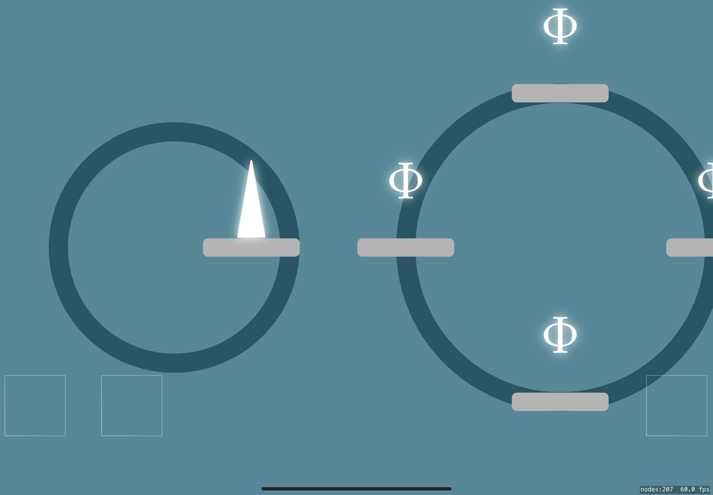
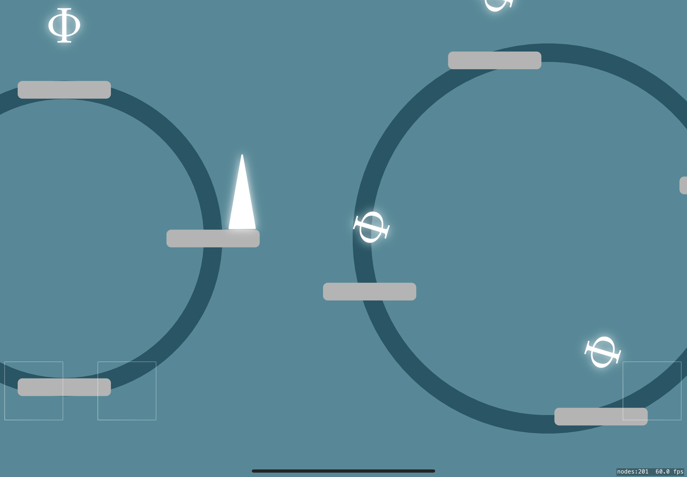
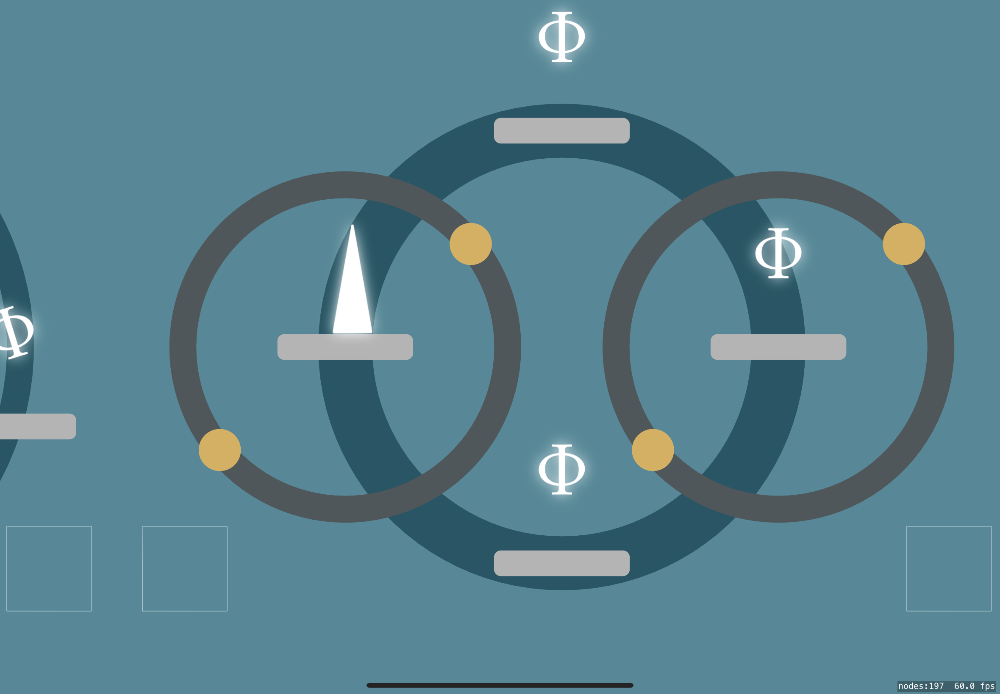
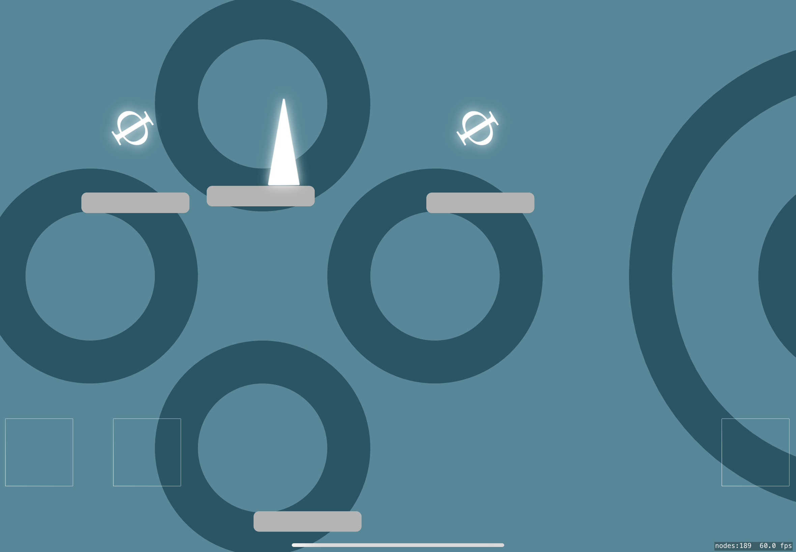
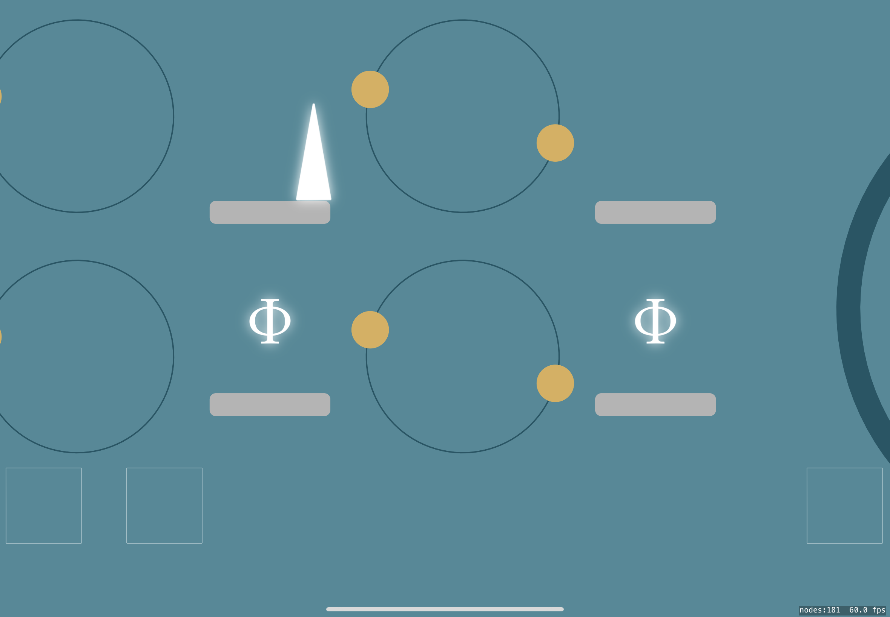
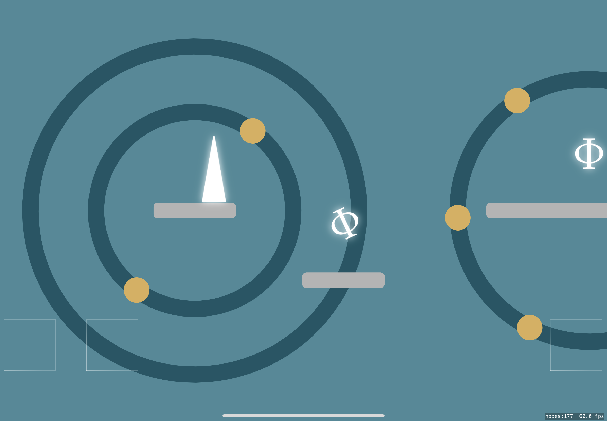
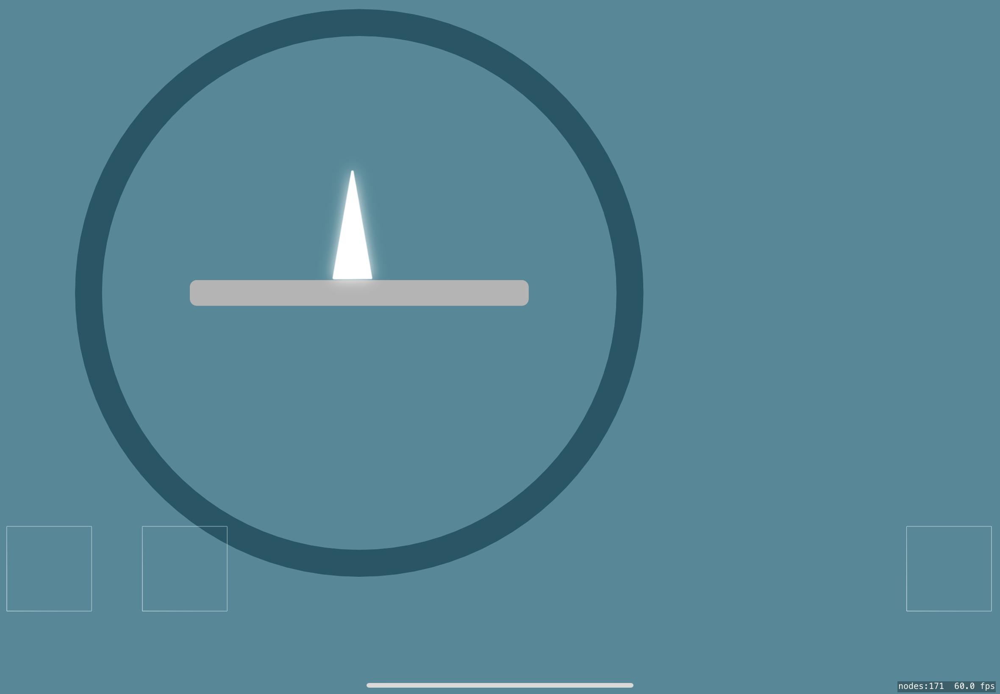

# Pt2-SpriteKitExperiment
My experiment with SpriteKit from two years ago.
Found it in my archive and I don't want to lose it. It is a simple
platformer game that I spent time on to learn the basics of game development 
and experience working with game engines.

